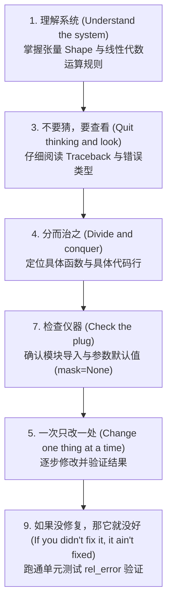

# Transformer Scaled Dot-Product Attention 调试复盘与经验总结

在实现 Transformer 的缩放点积注意力机制（Scaled Dot-Product Attention）过程中，我们遇到了一系列涵盖**模块导入**、**张量维度/索引**、**矩阵乘法匹配**、**条件掩码处理**以及**Softmax 归一化维度理解**等典型的 PyTorch 调试问题。

本文将结合经典的 **《调试九法》（The 9 Indispensable Rules for Finding Even the Most Elusive Software and Hardware Problems）**，对本次调试过程进行全面梳理与复盘。

---

## 一、 调试九法（The 9 Rules of Debugging）对照复盘



---

## 二、 报错问题链与根因剖析

### 问题 1：`NameError: name 'math' is not defined`

* **代码位置**：[transformers.py (Line 134)](file:///D:/zjy/Deep_Learning/EECS498-Deep-Learning-for-CV/Assignment5/A5/transformers.py#L134)
* **错误日志**：
  ```python
  NameError: name 'math' is not defined
  ```
* **对应调试法则**：**规则七：检查仪器 (Check the plug)**
* **根因分析**：在计算注意力缩放因子 $\sqrt{M}$ 时使用了 `math.sqrt(M)`，但 [transformers.py](file:///D:/zjy/Deep_Learning/EECS498-Deep-Learning-for-CV/Assignment5/A5/transformers.py) 顶部没有 `import math`。
* **解决方案**：
  * **方案 A**（推荐）：在文件头部添加 `import math`。
  * **方案 B**：改用 Python 内置幂运算符 `(M ** 0.5)`。

---

### 问题 2：`IndexError: too many indices for tensor of dimension 1`

* **代码位置**：[transformers.py (Line 134)](file:///D:/zjy/Deep_Learning/EECS498-Deep-Learning-for-CV/Assignment5/A5/transformers.py#L134)
* **错误日志**：
  ```python
  IndexError: too many indices for tensor of dimension 1
  ```
* **对应调试法则**：**规则一：理解系统 (Understand the system)**
* **根因分析**：
  `scores` 是通过 `torch.zeros(K)` 初始化的**一维向量**（Shape: `(K,)`）。一维 Tensor 只有第 0 个维度，尝试使用二维切片 `scores[kk, :]` 会导致多维切片越界。
* **解决方案**：
  将 `scores[kk, :]` 改为 `scores[kk]`。

---

### 问题 3：`RuntimeError: size mismatch, got input (5), mat (5x4), vec (5)`

* **代码位置**：[transformers.py (Line 136)](file:///D:/zjy/Deep_Learning/EECS498-Deep-Learning-for-CV/Assignment5/A5/transformers.py#L136)
* **错误日志**：
  ```python
  RuntimeError: size mismatch, got input (5), mat (5x4), vec (5)
  ```
* **对应调试法则**：**规则一：理解系统 (Understand the system)** & **规则三：不要猜，要查看 (Quit thinking and look)**
* **根因分析**：
  在计算最终的加权 Value 时：
  * `weights` 的 Shape 为 `(K,)` = `(5,)`
  * `value` 的 Shape 为 `(K, M)` = `(5, 4)`

  执行 `torch.matmul(value, weights)` 相当于试图将 `(5, 4)` 矩阵与 `(5,)` 向量做乘法，内维数（4 与 5）不匹配。
  根据加权求和定义，应该用 `(5,)` 向量与 `(5, 4)` 矩阵做向量-矩阵乘法，得到 `(4,)` 的加权向量。
* **解决方案**：
  将 `torch.matmul(value, weights)` 改为 `torch.matmul(weights, value)`（或 `weights @ value`）。

---

### 问题 4：`TypeError: masked_fill() received an invalid combination of arguments...`

* **代码位置**：[transformers.py (Line 252)](file:///D:/zjy/Deep_Learning/EECS498-Deep-Learning-for-CV/Assignment5/A5/transformers.py#L252)
* **错误日志**：
  ```python
  TypeError: masked_fill() received an invalid combination of arguments - got (Tensor, NoneType, bool)...
  ```
* **对应调试法则**：**规则四：分而治之 (Divide and conquer)** & **规则七：检查仪器 (Check the plug)**
* **根因分析**：
  1. **空指针/无掩码未处理**：当调用方未提供 `mask` 时，`mask` 默认值为 `None`。原代码无条件调用 `torch.masked_fill(scores, mask, True)` 传入了 `NoneType`。
  2. **填充值类型错误**：`masked_fill` 的第三个参数应该是被替换填充的数值（注意力掩码填 `-1e9`），而不是布尔值 `True`。
  3. **Softmax 缺失括号**：`.softmax` 没有加括号 `()` 导致它只是方法对象而非方法调用。
* **解决方案**：
  检查 `mask is not None`，并正确使用 `scores.masked_fill(mask, -1e9)`：
  ```python
  if mask is not None:
      scores = scores.masked_fill(mask, -1e9)
  weights_softmax = scores.softmax(dim=-1)
  ```

---

## 三、 核心概念突破：Softmax 的 `dim` 维度选择

在调试过程中，一个核心的理论盲点是：**为什么在 `no_loop_batch` 中 Softmax 需要设置 `dim=-1`（即 `dim=2`），而在前面循环版本中是 `dim=0`？**

### 张量 Shape 对比分析

| 函数 | `scores` 张量 Shape | Softmax 作用的目标 | 为什么选此维度？ |
| :--- | :--- | :--- | :--- |
| `two_loop_single` | **`(K,)`** | `dim=0` | `scores` 只有 1 个维度，只能对第 0 维归一化 |
| `two_loop_batch` | **`(K,)`**（循环内） | `dim=0` | 提取出单个 Query 后的局部向量，依然是一维 |
| `no_loop_batch` | **`(N, K, K)`** | **`dim=-1`** (即 `dim=2`) | 全量计算出的 3D 矩阵：`(Batch, Query_seq, Key_seq)` |

### `(N, K, K)` 维度的物理意义

在 `(N, K, K)` 的得分矩阵中：
* 维度 0 (`N`)：Batch 索引（批次之间互不干扰）
* 维度 1 (`K`)：Query 的位置索引（代表第 $i$ 个 Query）
* 维度 2 (`K`)：Key 的位置索引（代表第 $i$ 个 Query 对各个 Key 的相关度得分）

注意力机制的理论要求是：**固定某一个 Query，对它关联的所有 Key 的得分做 Softmax 归一化（使各 Key 概率之和为 1）**。

因此：
* 错选 `dim=0`：会在**不同 Batch 之间**计算 Softmax（逻辑错误）。
* 错选 `dim=1`：会在**不同 Query 之间**计算 Softmax（逻辑错误）。
* **选择 `dim=-1`（即 `dim=2`）**：在**当前 Query 对应的所有 Key 维度**计算 Softmax（物理意义正确）。

---

## 四、 正确实现参考代码

### 1. `scaled_dot_product_two_loop_single`
```python
def scaled_dot_product_two_loop_single(
    query: Tensor, key: Tensor, value: Tensor
) -> Tensor:
    K, M = query.shape
    out = torch.zeros(K, M, dtype=query.dtype, device=query.device)
    for kq in range(K):
        scores = torch.zeros(K, device=query.device, dtype=query.dtype)
        for kk in range(K):
            dot_product = torch.dot(query[kq], key[kk])
            scores[kk] = dot_product / (M ** 0.5)
        weights = scores.softmax(dim=0, dtype=scores.dtype) 
        out[kq] = torch.matmul(weights, value)
    return out
```

### 2. `scaled_dot_product_no_loop_batch`
```python
def scaled_dot_product_no_loop_batch(
    query: Tensor, key: Tensor, value: Tensor, mask: Tensor = None
) -> Tensor:
    _, _, M = query.shape

    # 1. 批量矩阵乘法求缩放点积得分: (N, K, M) x (N, M, K) -> (N, K, K)
    scores = torch.bmm(query, key.transpose(1, 2)) / (M ** 0.5)

    # 2. 掩码处理 (将 mask=True 对应的位置填充为 -1e9)
    if mask is not None:
        scores = scores.masked_fill(mask, -1e9)

    # 3. 对最后一个维度 (Key 维度) 计算 Softmax: (N, K, K)
    weights_softmax = scores.softmax(dim=-1)

    # 4. 加权求和得到输出: (N, K, K) x (N, K, M) -> (N, K, M)
    y = torch.bmm(weights_softmax, value)

    return y, weights_softmax
```

---

## 五、 调试心法与总结

1. **看清错误信息**：`NameError` 查导入，`IndexError` 查维度，`RuntimeError` 查矩阵 Shape，`TypeError` 查函数入参类型与 `None` 值。
2. **画出 Tensor 形状变化链**：
   $$\text{Query}(N, K, M) \times \text{Key}^T(N, M, K) \xrightarrow{\text{bmm}} \text{Scores}(N, K, K) \xrightarrow{\text{Softmax(dim=-1)}} \text{Weights}(N, K, K) \times \text{Value}(N, K, M) \xrightarrow{\text{bmm}} \text{Output}(N, K, M)$$
3. **保持变量类型与物理意义一致**：
   * 概率归一化一定要在对应被求和的索引维度上操作。
   * 条件参数（如 `mask`）务必先判定非空（`if mask is not None`）。

---

## 六、 解码器掩码（`get_subsequent_mask`）实现与向量化技巧

在 Transformer Decoder 中，训练阶段为了防止模型“偷看”未预测的未来单词，需要构造未来信息掩码（Subsequent Mask / Casual Mask）。

### 1. 物理含义与预期矩阵形状

对于长度为 $K$ 的序列，注意力矩阵形状为 $(K, K)$。第 $i$ 行代表第 $i$ 个词关注第 $j$ 个词：
* $j > i$（右上角）：属于未来词，掩码设为 `True`（表示需遮住/Mask）。
* $j \le i$（对角线及左下角）：属于过去/当前词，掩码设为 `False`（表示保留）。

### 2. 高效向量化实现代码

```python
def get_subsequent_mask(seq):
    # seq Shape: (N, K) 或 (N, K, M)
    N, K = seq.shape[0], seq.shape[1]
    
    # 1. 利用上三角矩阵生成 (K, K) 布尔掩码，diagonal=1 表示对角线上方第 1 偏线及其右上角全为 True
    subsequent_mask = torch.triu(torch.ones((K, K), device=seq.device, dtype=torch.bool), diagonal=1)
    
    # 2. 增加批次维度并广播拓展到 (N, K, K)
    mask = subsequent_mask.unsqueeze(0).expand(N, K, K)
    return mask
```

### 3. 关键函数拆解说明

* **`torch.triu(..., diagonal=1)`**：
  * `torch.ones((K, K), dtype=torch.bool)` 生成全为 `True` 的矩阵。
  * `diagonal=1` 保留主对角线上方第 1 条线及右上角为 `True`，其余填充为 `False`。
  * 形状示意（以 $K=3$ 为例）：
    $$\begin{bmatrix} \text{False} & \text{True} & \text{True} \\ \text{False} & \text{False} & \text{True} \\ \text{False} & \text{False} & \text{False} \end{bmatrix}$$
* **`unsqueeze(0).expand(N, K, K)`**：
  在最前面扩展 Batch 维度（从 $(K, K) \to (1, K, K)$），再通过 `expand` 无额外内存消耗地广播复制到 $N$ 个样本上，达到 $(N, K, K)$ 的输出要求。

---

## 七、 Dropout 随机数种子与单元测试伪报错现象

在验证 `EncoderBlock` / `DecoderBlock` 时，若测试带有 `dropout > 0`（如 `dropout = 0.2`）：
* **现象**：输出结果的数值完全对得上，但 `rel_error` 却刚好固定在 `0.5004` 左右。
* **根因剖析**：
  * `Dropout` 会随机置零 20% 的数值。
  * 若网络子模块在 `__init__` 中的定义顺序或随机数消耗次数与测试预留的期望值稍有不一致，全局随机种子（RNG State）就会产生微小偏移。
  * 当你算出来的非零数值在位置 A，而期望值的非零数值在位置 B 时，相对误差公式 $\frac{|x - y|_{max}}{|x|_{max} + |y|_{max}}$ 计算出来恰好为 $\frac{V}{V + V} \approx 0.5$。
* **排查方法**：将 `dropout` 临时设为 `0.0`，若相对误差降为 `0.0`（$10^{-7}$ 级别），则证明网络结构和计算逻辑 100% 正确！
